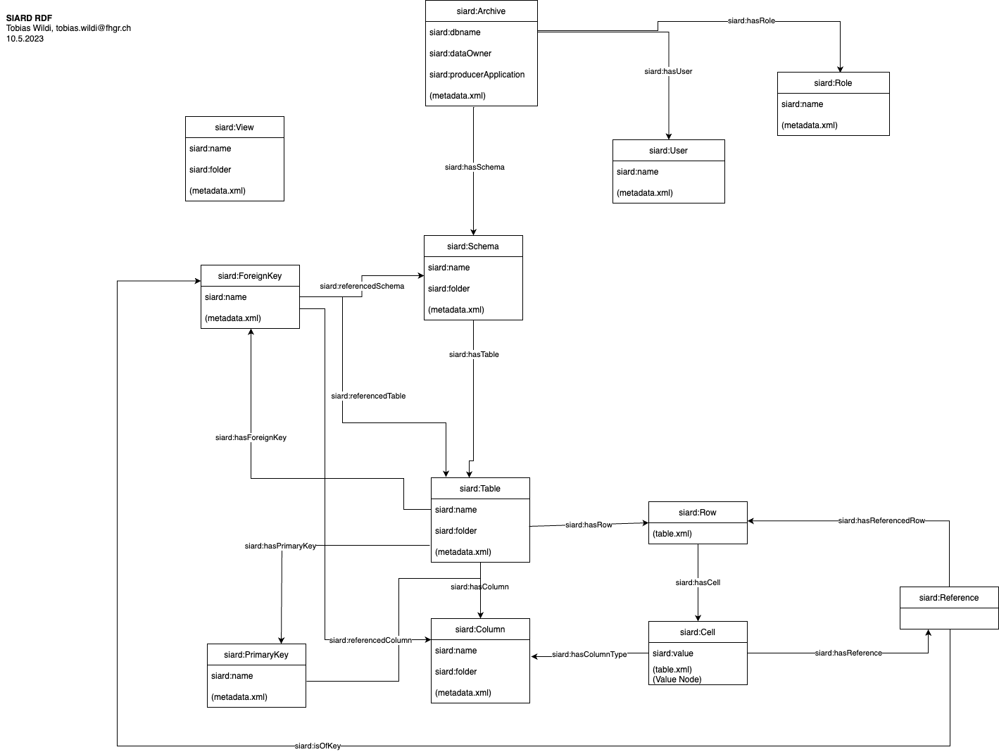

# SIARD-O — SIARD Ontology

[](https://creativecommons.org/licenses/by/4.0/)
[](https://www.w3.org/TR/owl2-overview/)
[](https://www.w3.org/TR/shacl/)
[](https://siard.link#)

**Swiss Federal Archives SIARD Ontology (SIARD-O)** — a formal OWL representation of the [SIARD 2.2 standard](https://github.com/DILCISBoard/SIARD) for the semantic description and long-term preservation of relational databases.

---

## Table of Contents

1. [Background: The SIARD Standard](#background-the-siard-standard)
2. [Purpose and Goals](#purpose-and-goals)
3. [Ontology Structure](#ontology-structure)
   - [Class Hierarchy](#class-hierarchy)
   - [Object Properties](#object-properties)
   - [Data Properties](#data-properties)
4. [SHACL Validation Shapes](#shacl-validation-shapes)
5. [Ontology Diagram](#ontology-diagram)
6. [Repository Contents](#repository-contents)
7. [Namespaces](#namespaces)
8. [Usage](#usage)
9. [License](#license)
10. [Contributors](#contributors)

---

## Background: The SIARD Standard

**SIARD** (*Software Independent Archiving of Relational Databases*) is an open, vendor-neutral file format developed by the **Swiss Federal Archives** for the long-term digital preservation of relational databases. It is standardised and maintained by the [DILCIS Board](https://dilcis.eu/) (Digital Information LifeCycle Interoperability Standards Board) and is widely adopted across European national archives and public institutions.

A SIARD file is a ZIP archive that bundles:

- **`metadata.xml`** — a structured XML document describing the complete database schema (schemas, tables, views, columns, keys, routines, users, roles) together with archival provenance metadata.
- **`table*.xml` files** — individual XML files containing the actual row-level data for each table.
- **Large Object (LOB) storage** — optional external or internal storage for binary and character large objects (BLOBs/CLOBs).

The current version of the standard, **SIARD 2.2**, defines the authoritative XML Schema (XSD) for the metadata and table data formats. It mandates that column types be recorded as SQL:2008 standard types alongside the original proprietary database types, ensuring the archive remains interpretable independently of the original database management system.

---

## Purpose and Goals

SIARD-O translates the SIARD 2.2 standard into a **formal OWL 2 ontology**, making the conceptual model of a SIARD archive machine-readable, interoperable, and queryable using Semantic Web technologies. The ontology serves several concrete purposes:

### 1. Formal Knowledge Representation
SIARD-O provides a precise, logic-based description of the entities and relationships that make up a SIARD archive. Where the SIARD standard is expressed as an XML Schema, SIARD-O expresses the same model as an OWL ontology — enabling reasoning, inference, and formal consistency checking.

### 2. Linked Data Integration
By assigning globally unique IRIs to every concept (namespace `http://siard.link#`), SIARD-O enables SIARD metadata to be published as **Linked Open Data**. Individual archives, schemas, tables, columns, and even data cells can become addressable resources on the Web, linkable to other datasets such as authority files, thesauri, or institutional records systems.

### 3. Cross-Archive Search and Discovery
Once multiple SIARD archives are represented as RDF graphs conforming to SIARD-O, federated SPARQL queries can be run across institutional repositories. Archivists and researchers can discover, for example, which archives share a common schema structure, which databases were produced by a particular application, or which archives contain tables referencing a specific data owner.

### 4. Interoperability with Other Standards
The ontology is designed to serve as a **semantic bridge** between SIARD archives and other metadata standards used in archives and libraries (e.g., Dublin Core, PROV-O, RDF Data Cube, DCAT). Its annotation properties already draw on Dublin Core (`dc:contributor`, `dcterms:publisher`) and Creative Commons (`cc:license`).

### 5. Validation and Quality Assurance
The companion **SIARD-Shapes.ttl** file provides SHACL (Shapes Constraint Language) shapes that define integrity constraints for SIARD-O instances — for example, that every `SiardArchive` must have at least one `Schema`, or that every `Column` must have a data type. This allows automated validation of RDF representations of SIARD archives.

### 6. Long-Term Preservation Research and Tool Development
SIARD-O provides a shared vocabulary for researchers and developers working on tools for digital preservation, database archiving, and archival information systems. It supports the development of conversion tools that transform SIARD XML files into RDF, enabling archives to exploit Semantic Web infrastructure for access and reuse of archived database content.

---

## Ontology Structure

**Namespace:** `http://siard.link#`  
**Preferred prefix:** `siard:`  
**OWL version:** OWL 2, serialised as Turtle  
**Based on:** SIARD 2.2

### Class Hierarchy

The ontology defines 14 classes organised in a single-rooted hierarchy under `siard:Thing`:

```
siard:Thing
├── siard:SiardArchive         — The top-level container representing one SIARD archive file
├── siard:Schema               — A database schema; container for Tables, Views, and Routines
├── siard:Table                — A database table with columns, rows, and integrity constraints
│   └── siard:View             — A stored SQL query whose result set is treated as a table
├── siard:Column               — A column in a Table or View, with type and constraint metadata
├── siard:Row                  — A single record (tuple) in a Table, stored in table*.xml
├── siard:Cell                 — A single field value within a Row
├── siard:Key                  — Abstract superclass for all key types
│   ├── siard:PrimaryKey       — The primary key of a Table
│   ├── siard:CandidateKey     — An alternate unique key (candidate for primary key)
│   └── siard:ForeignKey       — A referential integrity constraint linking tables
├── siard:Reference            — A reference target for a ForeignKey constraint
├── siard:Role                 — A database role defined in the archive
├── siard:Routine              — A SQL stored procedure or function (important for View queries)
└── siard:User                 — A database user defined in the archive
```

| Class | Description |
|---|---|
| `siard:SiardArchive` | Root entity for a SIARD archive. Carries archival provenance metadata such as `archiver`, `archivalDate`, `dataOwner`, `databaseProduct`, and `version`. |
| `siard:Schema` | Logical namespace within a database that groups related Tables, Views, and Routines. Each archive has one or more schemas. |
| `siard:Table` | Core structural element. Contains `Column` definitions, `Row` data, a `PrimaryKey`, zero or more `CandidateKey`s, and zero or more `ForeignKey`s. |
| `siard:View` | A subclass of `Table` that results from a stored SQL query. Carries `query` and `queryOriginal` data properties. |
| `siard:Column` | Describes one column of a Table or View: its SQL:2008 `type`, `typeOriginal` (proprietary type), `nullable`, `defaultValue`, and optional `mimeType` for LOB columns. |
| `siard:Row` | One database record as stored in a `table*.xml` file. Connected to its `Cell` values via `hasCell`. |
| `siard:Cell` | The value of one field in one row. Carries the `value` data property and is linked to its `Column` type via `hasColumnType`. |
| `siard:PrimaryKey` | Unique identifier key for a Table, composed of one or more Columns. |
| `siard:CandidateKey` | An additional unique key that could serve as a primary key. |
| `siard:ForeignKey` | References one or more Columns in another Table/Schema to enforce referential integrity. Carries `deleteAction`, `updateAction`, and `matchType` properties. |
| `siard:Reference` | A reference node used in the resolution of ForeignKey constraints. |
| `siard:Role` | A named database role. Carries `admin` and `privilege` properties. |
| `siard:Routine` | A SQL routine (stored procedure/function). Primarily relevant for understanding View query expressions. |
| `siard:User` | A database user account recorded in the archive. |

### Object Properties

All object properties are subproperties of `siard:isRelatedTo`, the most generic relationship in the ontology. Most properties are defined with their **inverse** to enable traversal in both directions:

| Property | Inverse | Domain | Range | Description |
|---|---|---|---|---|
| `siard:hasSchema` | `siard:isSchemaOf` | `SiardArchive`, `ForeignKey` | `Schema` | Links an archive (or FK) to its Schema(s) |
| `siard:hasTable` | `siard:isTableOf` | `Schema`, `ForeignKey` | `Table` | Links a Schema to its Tables |
| `siard:hasColumn` | `siard:isColumnOf` | `Table`, `Key` | `Column` | Links a Table or Key to its Columns |
| `siard:hasRow` | `siard:isRowOf` | `Table` | `Row` | Links a Table to its data Rows |
| `siard:hasCell` | `siard:isCellOf` | `Row` | `Cell` | Links a Row to its field Cells |
| `siard:hasColumnType` | `siard:isColumnTypeOf` | `Cell` | `Column` | Links a Cell to its defining Column |
| `siard:hasPrimaryKey` | `siard:isPrimaryKeyOf` | `Table` | `PrimaryKey` | Links a Table to its Primary Key |
| `siard:hasCandidateKey` | `siard:isCandidateKeyOf` | `Table` | `CandidateKey` | Links a Table to a Candidate Key |
| `siard:hasForeignKey` | `siard:isForeignKeyOf` | `Table` | `ForeignKey` | Links a Table to a Foreign Key |
| `siard:referencedColumn` | `siard:isReferencedColumnOf` | `ForeignKey` | `Column` | Identifies the referenced Column in a FK |
| `siard:hasReferencedRow` | — | `Row` | `Row` | Links a Row to a referenced Row via FK |
| `siard:hasRole` | `siard:isRoleOf` | `SiardArchive` | `Role` | Links an archive to its database Roles |
| `siard:hasUser` | `siard:isUserOf` | `SiardArchive` | `User` | Links an archive to its database Users |
| `siard:isRelatedTo` | — | `Thing` | `Thing` | Generic top-level relationship |

### Data Properties

Data properties capture the metadata fields defined in SIARD's `metadata.xml` and the data values from `table*.xml`:

#### `siard:SiardArchive` — Archival Provenance Metadata

| Property | Description |
|---|---|
| `siard:version` | SIARD format version (e.g., `2.2`) |
| `siard:dbname` | Short identifier of the archived database |
| `siard:archiver` | Name of the person who performed the archiving |
| `siard:archiverContact` | Contact details (telephone, e-mail) of the archiver |
| `siard:archivalDate` | Date on which the archiving was performed |
| `siard:dataOwner` | Institution or person responsible for the data and usage rights |
| `siard:dataOriginTimespan` | Approximate period of origin of the data (free text) |
| `siard:databaseProduct` | Database management system and version used (e.g., `Oracle 12c`) |
| `siard:databaseUser` | Database user ID used during archiving |
| `siard:clientMachine` | DNS name of the machine on which archiving was performed |
| `siard:connection` | Connection string used to access the database during archiving |
| `siard:producerApplication` | Name and version of the tool that created the SIARD file |
| `siard:lobFolder` | Base URI for external LOB (Large Object) storage |

#### `siard:Column` — Schema Metadata

| Property | Description |
|---|---|
| `siard:type` | SQL:2008 standard data type of the column |
| `siard:typeOriginal` | Original proprietary data type as used in the source DBMS |
| `siard:nullable` | Whether the column accepts NULL values |
| `siard:defaultValue` | Default value defined for the column |
| `siard:mimeType` | MIME type hint for BLOB columns storing files of a uniform type |

#### `siard:Table` / `siard:Schema`

| Property | Domain | Description |
|---|---|---|
| `siard:rows` | `Table` | Number of data records in the table |
| `siard:folder` | `Table`, `Schema` | Folder name within the SIARD ZIP structure |

#### `siard:Cell`

| Property | Description |
|---|---|
| `siard:value` | The actual data value of the cell as stored in `table*.xml` |

#### `siard:ForeignKey`

| Property | Description |
|---|---|
| `siard:deleteAction` | Referential action on delete (e.g., `CASCADE`, `SET NULL`) |
| `siard:updateAction` | Referential action on update |
| `siard:matchType` | Match type for the FK constraint (e.g., `FULL`, `PARTIAL`, `SIMPLE`) |
| `siard:referencedSchema` | Name of the referenced schema |
| `siard:referencedTable` | Name of the referenced table |

#### `siard:Role`

| Property | Description |
|---|---|
| `siard:admin` | Administrator of the role (user or role name) |
| `siard:privilege` | Privilege granted to the role |

#### `siard:View`

| Property | Description |
|---|---|
| `siard:query` | SQL:2008 standard form of the view query |
| `siard:queryOriginal` | Original proprietary SQL query as defined in the source DBMS |

#### Generic (all `siard:Thing` subclasses)

| Property | Description |
|---|---|
| `siard:name` | Name of the entity (covers both `dbname` and element names) |
| `siard:description` | Free-text description of the meaning and content |

---

## SHACL Validation Shapes

The file `SIARD-Shapes.ttl` defines **SHACL node shapes** for validating RDF graphs against the structural requirements of SIARD-O. These shapes can be used with any SHACL-compliant processor (e.g., [Apache Jena](https://jena.apache.org/), [TopBraid SHACL](https://github.com/TopQuadrant/shacl), [pySHACL](https://github.com/RDFLib/pySHACL)) to check whether a generated SIARD-O RDF graph is well-formed.

Key constraints defined in the shapes file include:

- A `siard:SiardArchive` **must** have at least one `siard:hasSchema` link.
- A `siard:Table` **must** have at least one `siard:hasColumn` link.
- A `siard:Column` **must** have a `siard:type` literal value.
- Properties such as `siard:name` and `siard:description` must be plain literals.

---

## Ontology Diagram

The diagram below illustrates the main classes and relationships of SIARD-O, showing how a `siard:Archive` connects through `siard:Schema` and `siard:Table` down to individual `siard:Row` and `siard:Cell` instances, and how integrity constraints (`siard:PrimaryKey`, `siard:ForeignKey`, `siard:CandidateKey`) are modelled.



*Diagram: Tobias Wildi, 10.5.2023*

The editable source for this diagram is provided in `SIARD-ontology diagram.drawio`.

---

## Repository Contents

| File | Description |
|---|---|
| `SIARD-O.owl` | Main ontology file in OWL 2 / Turtle format |
| `SIARD-Shapes.ttl` | SHACL validation shapes for SIARD-O instance data |
| `SIARD-ontology diagram.drawio` | Editable draw.io source diagram of the ontology |
| `SIARD_RDF_20230510.drawio.png` | PNG export of the ontology diagram |
| `LICENSE` | CC0 1.0 Universal license for the repository |

---

## Namespaces

| Prefix | URI |
|---|---|
| `siard:` | `http://siard.link#` |
| `owl:` | `http://www.w3.org/2002/07/owl#` |
| `rdf:` | `http://www.w3.org/1999/02/22-rdf-syntax-ns#` |
| `rdfs:` | `http://www.w3.org/2000/01/rdf-schema#` |
| `xsd:` | `http://www.w3.org/2001/XMLSchema#` |
| `sh:` | `http://www.w3.org/ns/shacl#` |
| `dc:` | `http://purl.org/dc/elements/1.1/` |
| `dcterms:` | `http://purl.org/dc/terms/` |
| `cc:` | `http://creativecommons.org/ns#` |

---

## Usage

### Loading the Ontology

The ontology can be opened directly in **[Protégé](https://protege.stanford.edu/)** (version 5.x or later):

1. Open Protégé → *File* → *Open from file…*
2. Select `SIARD-O.owl`.
3. The class hierarchy, object properties, and data properties will be fully displayed.

For programmatic use, load the ontology with any RDF/OWL library:

```python
# Python — with RDFLib
from rdflib import Graph

g = Graph()
g.parse("SIARD-O.owl", format="turtle")
print(f"Loaded {len(g)} triples.")
```

```java
// Java — with Apache Jena
Model model = ModelFactory.createDefaultModel();
model.read("SIARD-O.owl", "TURTLE");
```

### Example SPARQL Query

List all classes defined in the ontology:

```sparql
PREFIX siard: <http://siard.link#>
PREFIX owl:   <http://www.w3.org/2002/07/owl#>
PREFIX rdfs:  <http://www.w3.org/2000/01/rdf-schema#>

SELECT ?class ?label ?comment WHERE {
  ?class a owl:Class ;
         rdfs:comment ?comment .
  OPTIONAL { ?class rdfs:label ?label }
}
ORDER BY ?class
```

### Validating Instance Data with SHACL

```bash
# Using pySHACL
pip install pyshacl
pyshacl -s SIARD-Shapes.ttl -m -i rdfs -a -j my-siard-instance.ttl
```

---

## License

The ontology (`SIARD-O.owl`, `SIARD-Shapes.ttl`) is published under the **[Creative Commons Attribution 4.0 International (CC BY 4.0)](https://creativecommons.org/licenses/by/4.0/)** license.

The remaining repository contents are released under **[CC0 1.0 Universal](https://creativecommons.org/publicdomain/zero/1.0/)** (see `LICENSE`).

---

## Contributors

| Name | Affiliation |
|---|---|
| **Tobias Wildi** | [Fachhochschule Graubünden (FHGR)](https://www.fhgr.ch/) — University of Applied Sciences of the Grisons |

**Publisher:** [Swiss Federal Archives](https://www.wikidata.org/entity/Q679141)

**Based on:** [SIARD 2.2 Standard](https://github.com/DILCISBoard/SIARD) — maintained by the [DILCIS Board](https://dilcis.eu/)

---

*SIARD-O version 0.1 — 21 December 2022*
